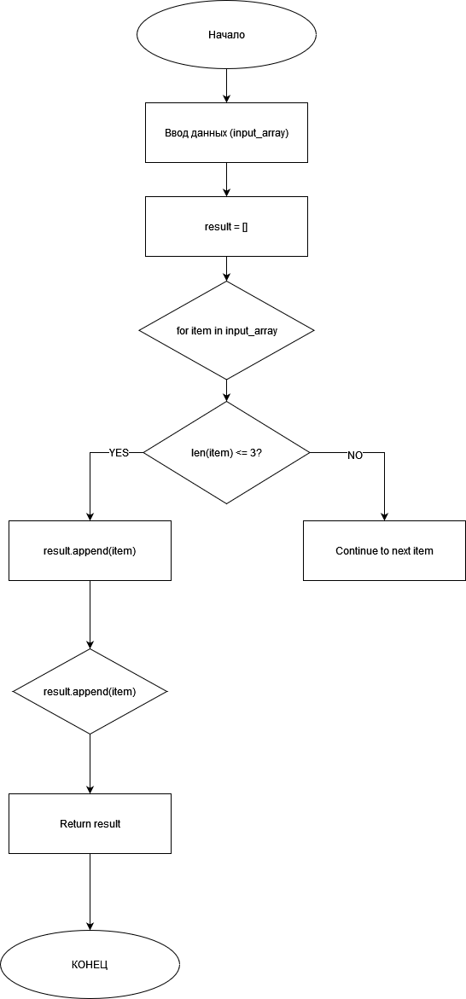

# Итоговая контрольная работа по основному блоку

### Описание 
Эта программа позволяет пользователю вводить строки текста и фильтровать их, оставляя только те строки, которые имеют длину 3 символа или меньше.

### Как это работает

Пользователь вводит строки.
Программа проверяет длину каждой строки.
Если строка имеет длину 3 символа или меньше, она добавляется в список.
После ввода всех строк и команды стоп, программа выводит список отфильтрованных строк.

### Диаграмма: 

    

